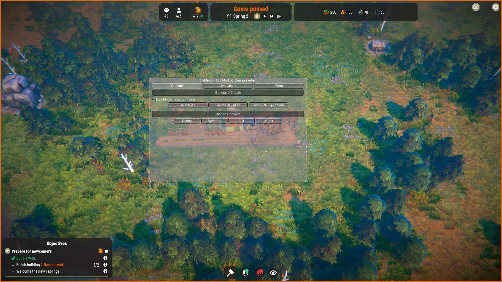
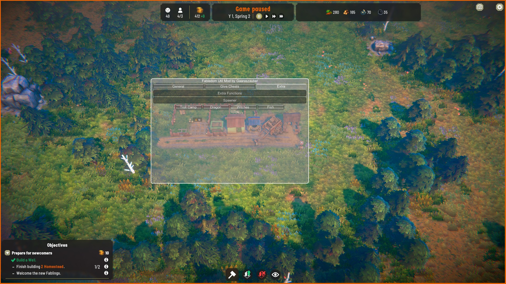

# My Fabledom Util Mod with MelonLoader

Welcome to my Fabledom Util Mod.

## Table of Contents

- [Installation](#installation)
- [Features](#features)
- [Usage](#usage)
- [In Dev](#inDev)
- [License](#license)
- [Virustotal](#virustotal)

## Installation

1. **Prerequisites**: Make sure you have MelonLoader installed. You can find installation information on the [MelonLoader GitHub page](https://github.com/LavaGang/MelonLoader).
2. **Download the Mod**: Download the `ZIP` file.
3. **Install the Mod**: Extract the `ZIP` file into the Fabledom folder.
4. **Start the Game**: Launch the game, and the mod should load automatically.

## Features

- **Change Seasons**: Allows players to switch between different seasons.
- **Unlock Units**: Unlocks various units such as Fablings, Peasants, Citizens, and Nobles.
- **Spawner Functions**: Enables spawning of Troll Camps, Dragons, Witches, and Fish.
- **Spawn Items**: Players can spawn various items in the game.
- **Activate Developer Mode**: Provides access to special development features and debugging options.
- **Unlock Functions**: Unlocks additional game content and features.

## Usage

After starting the game, you can access the following functions through the user interface:

1. **Change Seasons**
2. **Unlock Units**
3. **Use Spawners**
4. **Spawn Items**
5. **Activate Developer Mode**
6. **Use Unlock Functions**

To access the user interface, press the **F4 key** while in-game.

## In Dev

## Example Images

Here are some example images of the user interface:

*General Tab*

*Give Tab*

*Extra Tab*

## License

This project is licensed under the MIT License - see the [LICENSE](LICENSE) file for details.

## Virustotal

ZIP File: https://www.virustotal.com/gui/file/1fddacd9126351653480571fe87a2750dabb039f58ce4172bbd1e619f7853bf6 - 1fddacd9126351653480571fe87a2750dabb039f58ce4172bbd1e619f7853bf6

DLL File: https://www.virustotal.com/gui/file/90a499654013eb41d5d3e772b6508dd3b3124df42e3e1f709e691c359d623cc9 - 90a499654013eb41d5d3e772b6508dd3b3124df42e3e1f709e691c359d623cc9 

---

Thank you for checking out my project! If you have any questions or suggestions, feel free to contact me.
